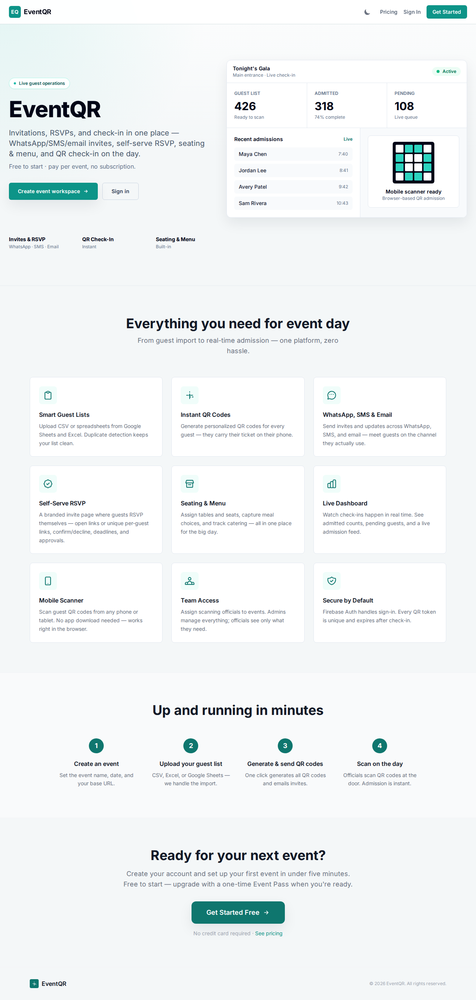
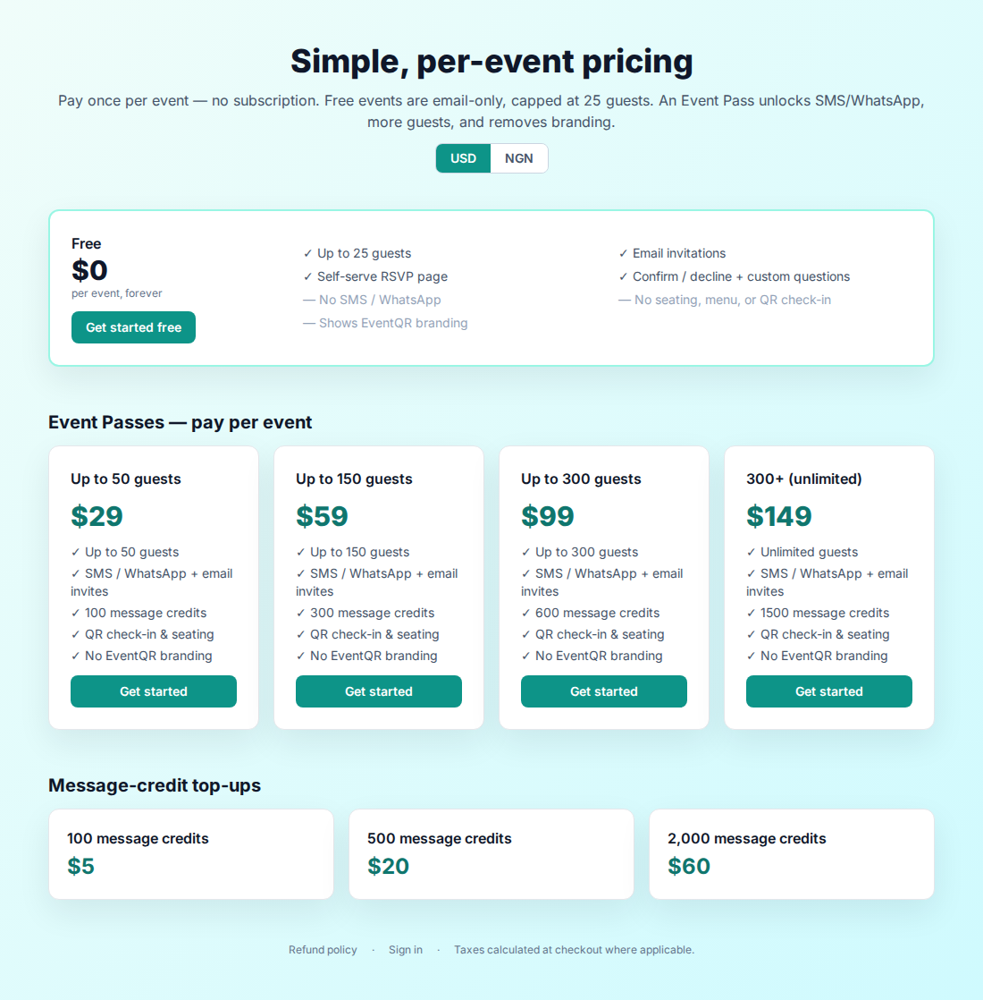
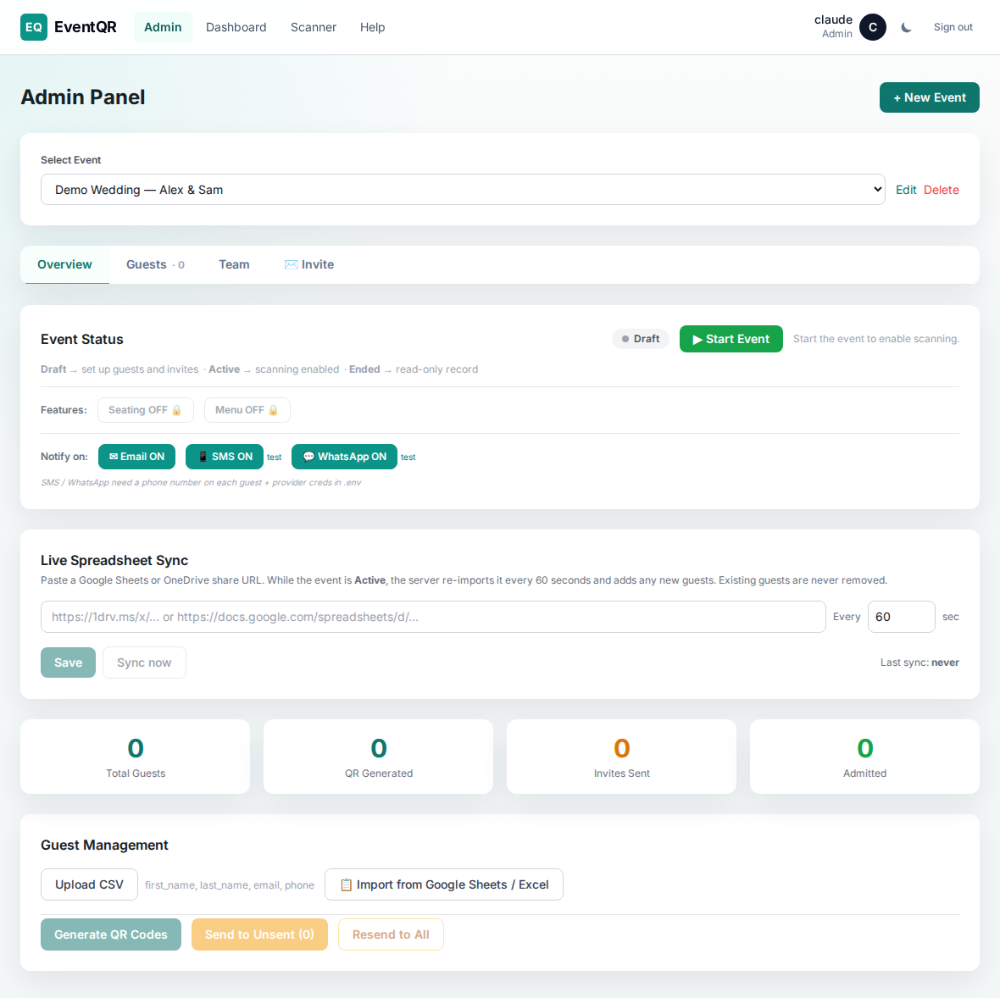
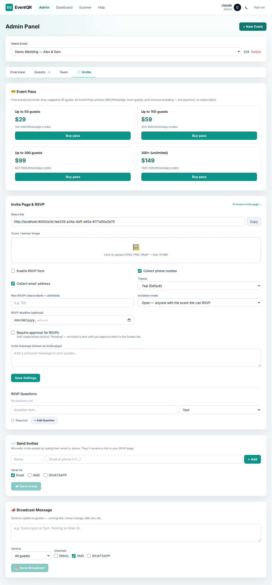
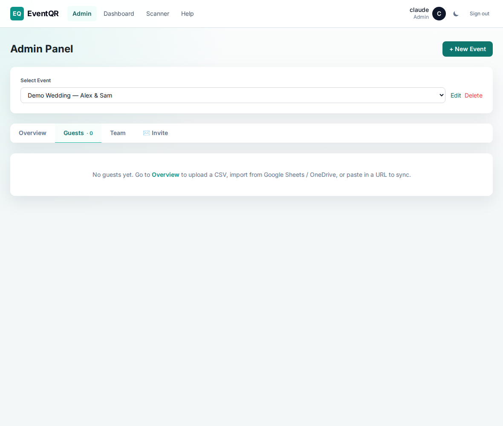
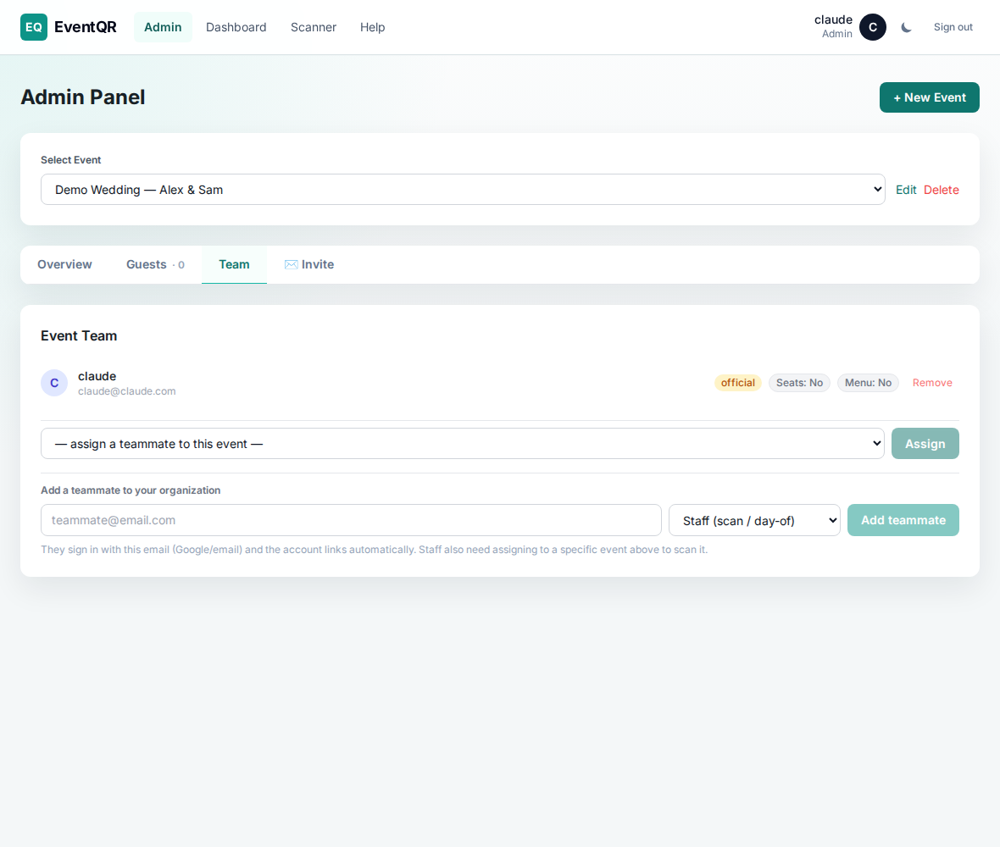
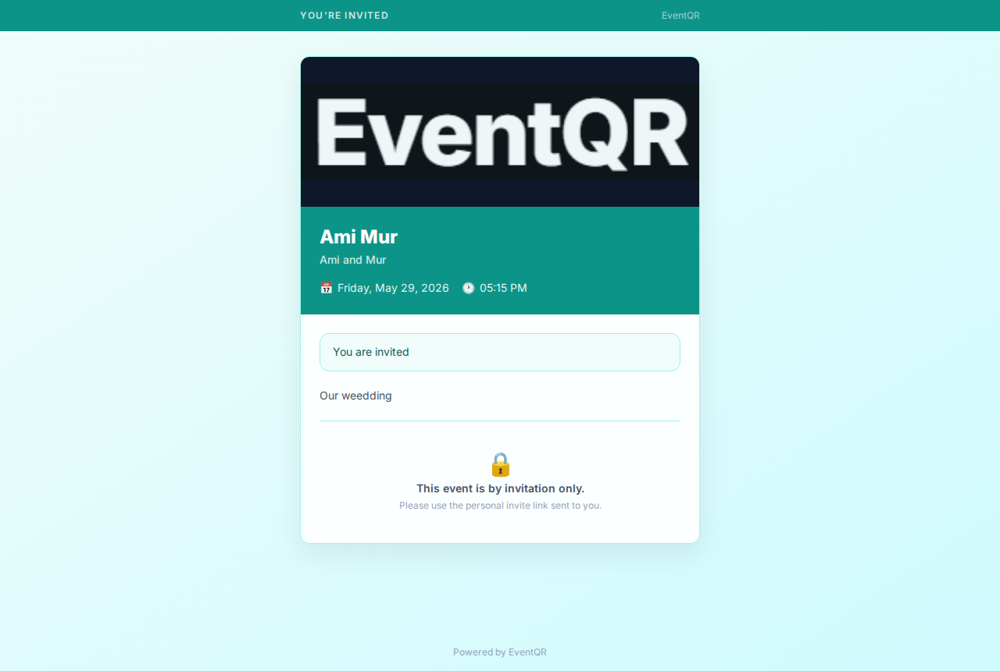
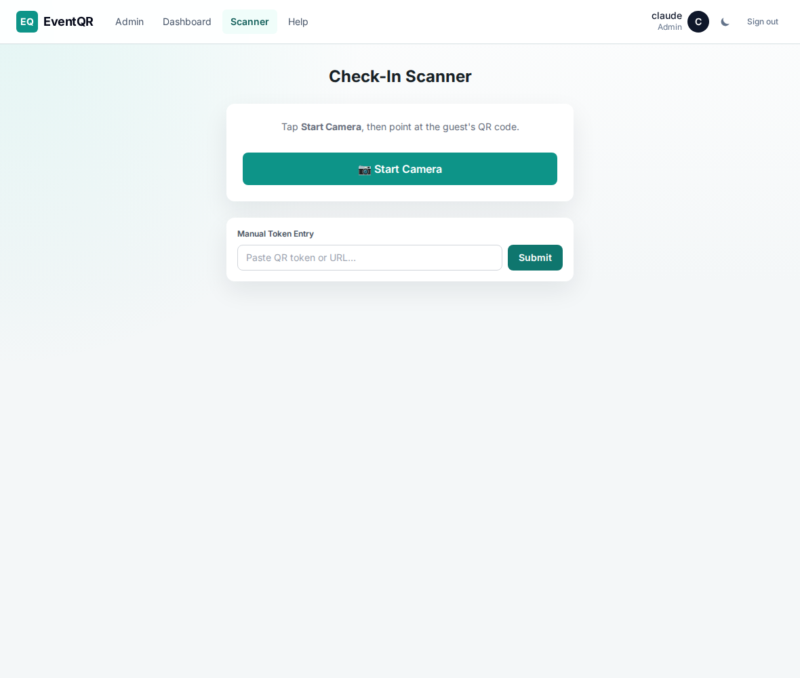

# EventQR — User Guide

Short, role-based instructions. Find your role and follow the steps.

- **Event organizer** — you run an event (create it, invite guests, check them in).
- **Staff / scanner** — you check guests in on the day.
- **Guest** — you received an invite.
- **Platform operator** — you run the EventQR platform itself.

Site: **https://events.vsgs.io**

---

## 1. Event organizer

### Get started
1. Go to the site → **Get Started** → sign in (Google or email).
2. You land in the **Admin** panel. You automatically get your own organization.

### Create your event
1. **Admin → New Event** → enter name, date, and details → save.
2. Open the event. You'll see tabs: **Overview, Guests, Team, Invite** (and **Seating / Menu** once enabled).

### Add your guest list
- **Overview tab** → upload a **CSV/Excel** or paste a **Google Sheets / OneDrive** link (columns: `first_name, last_name, email, phone`).
- Or add people one at a time in the **Guests tab**.
- Free events are limited to **25 guests**; an Event Pass raises this.

### Choose how people RSVP (Invite tab → "Invite Page & RSVP")
- **Open** — one shared link anyone can use to RSVP.
- **Closed** — invitation-only; each guest gets a **unique private link**.
- Optional: a **RSVP deadline**, and **require approval** (you approve each RSVP).
- Add a cover image, a message, and custom RSVP questions here too.

### Send invites
- **Open mode:** copy your event link (Invite tab → *Preview invite page*) and share it, or use **Manual invite** to send to specific emails/phones.
- **Closed mode:** use **Bulk RSVP invites** (Invite tab) — *Send to not-yet-invited*, *Remind no-reply*, or *Resend to all*. Each guest gets their personal link.
- Invites go by **email** on free events; **SMS/WhatsApp** need an Event Pass.

### Track responses
- **Guests tab** shows each person's RSVP status: **Attending / Declined / Pending / No reply**, and check-in status.
- If you turned on approval, approve/reject pending RSVPs there (or **Approve all**).

### Message everyone (Invite tab → Broadcast)
- Send an update (running late, venue change, etc.) to a target group: **All, RSVP Attending/Declined/No-reply, Checked-in, Not checked-in** — via email/SMS/WhatsApp.

### Seating & menu (paid feature)
- Turn on **Seating** / **Menu** in **Overview → Features** (requires an Event Pass).
- **Seating tab:** create tables, auto-assign or place guests, reserve seats.
- **Menu tab:** add menu categories/items; guests pick meals; track catering.

### Experience workflow
- Open **Team & settings → Experience** to create a guest journey workflow.
- Start with a workflow template such as **VIP dinner**, **Conference**, **Wedding reception**, or **Simple check-in**. You can also use **Create default workflow** or create a blank workflow.
- Common steps include **Main check-in**, **Seating assignment**, **Meal selection**, and custom operational tasks such as **Welcome pack collected**.
- Use **Consent form** to paste a waiver, media release, or event terms. Guests see it on their pass, type their signature, then can download HTML/PDF copies or email themselves a signed PDF copy.
- Publish the workflow when the event team should use it as the live runbook.
- Only one workflow can be live at a time. **Unpublish** returns a live workflow to draft, **Archive** stores a workflow out of live use, and **Unarchive** restores it as a draft.
- Use **Guest journey** to review one guest's progress and mark operational steps complete, blocked, skipped, failed, or overridden. Steps with prerequisites stay blocked until the prior steps are complete. The scanner also shows the guest's next available Experience steps after check-in and queues step completions if the device briefly goes offline.
- For offline scanning, open the scanner while online once so it can cache the active guest list and venue access rules. If connectivity drops, known QR tickets, gate scans, and zone scans can be processed on that device and replayed when the device comes online. Capacity is checked against the device cache while offline, then the server replays the final decision when syncing.
- Use **Export progress** to download the workflow progress CSV for operations review.
- See a sample setup in [Festio Sample Experience Guide](FESTIO-SAMPLE-EXPERIENCE-GUIDE.md).

### Add your team
- **Team tab → "Add a teammate"**: enter their email + role (**Staff** to scan, **Admin** to manage). They sign in with that email and it links automatically.
- Then **assign** staff to the specific event (dropdown) so they can scan it.

### On the day — check-in
- Check-in requires an **Event Pass**. Set the event to **Active** (Overview).
- You or your staff open **Scanner**, scan each guest's QR — admission is instant.
- Watch it live in **Dashboard**.

### Upgrade (Event Pass) — Invite tab → "💳 Event Pass"
- A free event is email-only, 25 guests, no seating/menu/check-in, EventQR branding.
- **Buy a pass** to unlock SMS/WhatsApp, more guests, seating & menu, QR check-in, and to remove branding. One payment per event — no subscription.
- Running low on SMS/WhatsApp? Buy a **credit top-up** in the same panel.
- See plans any time at **/pricing**.

**Event overview** (status, features, guest import):

**Invite tab** (Event Pass, RSVP settings, broadcast):

**Guests** (RSVP status + check-in):

**Team** (add teammate + assign to event):

---

## 2. Staff / scanner

1. You'll get an email/message to join — sign in at the site with **that email**.
2. The organizer assigns you to an event.
3. Open **Scanner** → point your phone/tablet camera at each guest's QR code.
   - **Green / Welcome** = admitted.
   - **Already admitted** = ticket was used.
   - **Not assigned / needs pass** = ask the organizer.
4. No app to install — it works in the browser.

---

## 3. Guest

1. You'll receive an invite by **email, SMS, or WhatsApp** with a link.
2. Open it → fill in the **RSVP** form (and any questions) → **Confirm** (or **Can't make it**).
   - On a personal link you can change your answer until the deadline.
3. Once confirmed, your **ticket QR** is emailed to you.
4. On the day, show the **QR** (on your phone or printed) at the entrance.

The scanner (staff check-in):

---

## 4. Platform operator (EventQR admin)

Operator accounts see a **Console** link in the top nav (`/console`). Everyone else does not.

- **Overview** — every organization and its events, with plan and credit balance.
  - **Comp** an event onto a tier, or **add message credits**, with one click (no payment).
- **Pricing** — edit tiers and credit packs (label, price in USD/NGN, credits, guest cap, active). Changes show on the live pricing page and checkout immediately.
- **Operators** — add another operator by email, or revoke one. (You can't revoke yourself.)

To make someone an operator: **Console → Operators → add their email**. They get access on next sign-in.

---

## Screenshots

Images live in `docs/images/` (and the same set in `event-checkin/frontend/public/guide/`
for the in-app `/help` page). Public + admin/scanner shots use a demo event, so no
real guest data is shown. The operator Console is intentionally text-only here
(it lists real tenants). To refresh a shot, replace the file with the same name.
