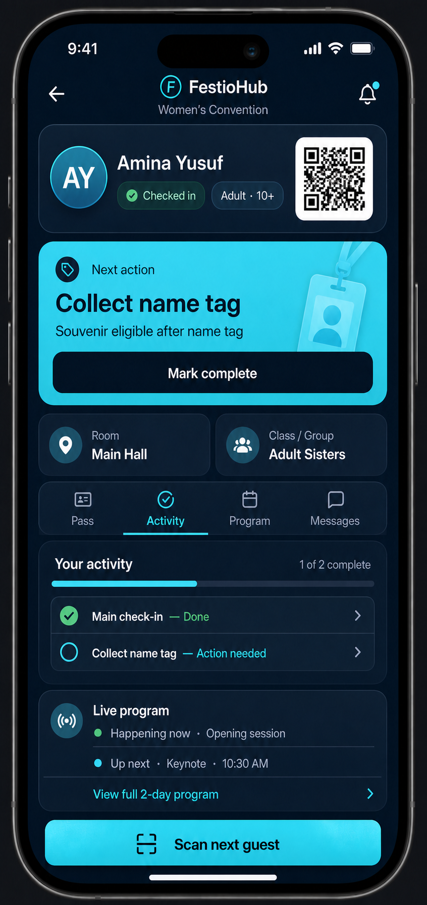

# FestioHub Event-Day Redesign Proposal

## Staging inspection

The production guest token supplied for review does not exist in staging. An equivalent staging guest was
inspected read-only using an Experience-enabled event with Live Program data.

Observed staging data:

- 2 program days;
- 10 program segments;
- 2 Experience steps;
- 1 current next step.

The supplied live-event guest journey was also inspected read-only to understand scale. It contains 3 program
days and 57 program segments, but only 4 Experience steps. This explains why the guest FestioHub becomes long.

Current mobile render order in `frontend/src/pages/InvitePage.jsx`:

1. FestioHub header;
2. installation prompt/card;
3. notification card;
4. Live Program “happening now” and “up next”;
5. day selector and every segment for the selected day;
6. Experience progress and next steps;
7. menu, communication, and other hub content.

This confirms that a long program pushes the guest's Experience activity far below the initial FestioHub viewport.
It does **not** prove that staff saw the program inside Scanner.

## Product decision

Do not combine the staff Scanner result and guest FestioHub into one interface. They use related journey data
but have different jobs:

- Staff need identity, eligibility, assignment, next staff action, and “scan next guest.”
- Guests need their pass, current next step, activity progress, a concise program preview, and messages.

## Guest FestioHub redesign

Default tab selection:

- `Activity` when an actionable Experience step exists;
- otherwise `Pass` when the guest has an active QR pass;
- never default to the full Program list.

Initial viewport:

1. Compact identity/pass card with QR, check-in state, and relevant category/age group.
2. One prominent **Your next step** card.
3. Room/group assignment summary.
4. Tabs: **Pass · Activity · Program · Messages**.
5. Compact activity progress.
6. Live Program preview with only “Happening now” and up to two “Up next” items.

The complete multi-day agenda belongs exclusively in the Program tab. Installation and notification setup move
to a secondary settings/menu surface and should not interrupt event-day use.

## Staff Scanner investigation and redesign

`frontend/src/pages/ScannerPage.jsx` uses its own `ResultCard`. It does not render FestioHub or Live Program.
The card displays admission state, guest name, message, admission time, table/seat, and every item returned in
`experience_next_steps`, followed by **Check in next guest**.

Therefore there are two separate scrolling risks:

- FestioHub: the complete selected-day agenda appears before guest activity (confirmed with 57 live segments).
- Scanner: `experience_next_steps` is mapped without a display limit, so several actionable steps can push
  **Check in next guest** below the viewport. These are Experience steps, not Live Program agenda segments.

The feedback wording may combine what staff observed on a guest's phone with their scanner workflow. Current code
does not support the conclusion that the full program rendered inside Scanner.

After a successful scan, the scanner stays in the scanner workflow and shows:

- guest identity and QR/check-in result;
- age or configured age group;
- eligibility (for example, souvenir eligible/not eligible);
- room/class/group assignment;
- one current station action;
- activity summary behind a disclosure;
- a persistent **Scan next guest** action.

The scanner must not render the full Live Program or general guest content.

## Recommended implementation sequence

1. Add tabs to `GuestHub` and move the full program into `Program`.
2. Default to `Activity` when `journey.next_steps` is non-empty.
3. Keep only current/up-next program summaries outside the Program tab.
4. Move install/push configuration behind a secondary menu and suppress prompts during active event hours.
5. Compact the existing staff `ResultCard` in `ScannerPage.jsx`; do not reuse `GuestHub` or `ScanAutoPage`.
   Show one highest-priority action, collapse the remaining steps, and keep **Check in next guest** sticky/visible.
6. Add configured age-group/eligibility fields to the scan response and UI.
7. Add station-specific action filtering so name-tag, souvenir, and classroom desks see only relevant steps.

## Acceptance criteria

- A guest can see their next action without scrolling on a common mobile viewport.
- A staff member can see identity, eligibility, assignment, and next station action without opening FestioHub.
- The full program is one tap away but never blocks operational activity.
- Ten or more agenda items do not increase the initial Activity tab height.
- Installation/notification prompts do not appear during a rapid scanning workflow.
- Age/eligibility is derived from stored data and visible only to authorized event staff.
- Completing a physical-token step can automatically unlock or complete a dependent souvenir step when configured.

The coordinated three-surface mockups and organizer layout editor are documented in
[`FESTIO_THREE_SURFACE_MOCKUPS.md`](FESTIO_THREE_SURFACE_MOCKUPS.md).
