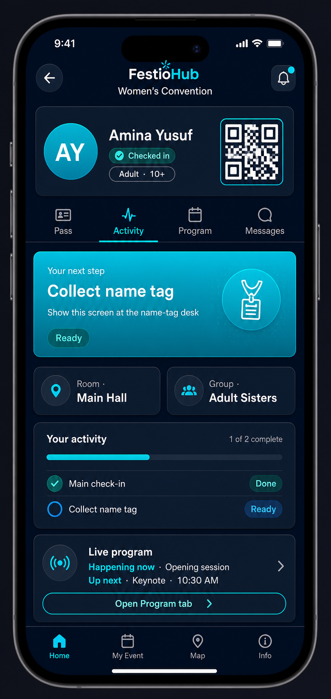
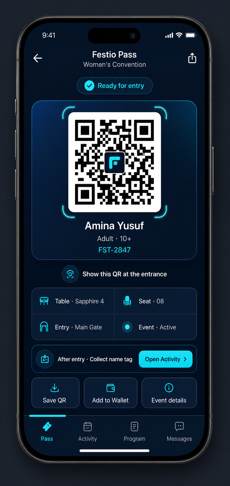
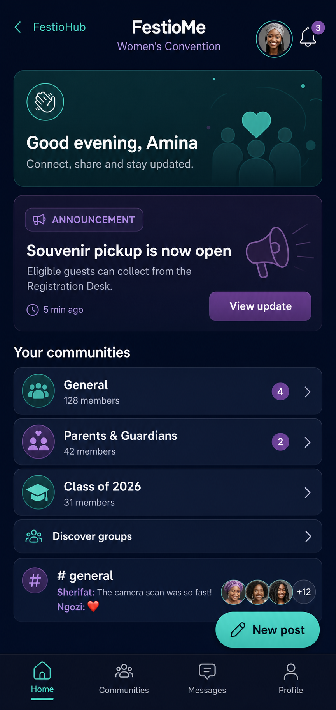
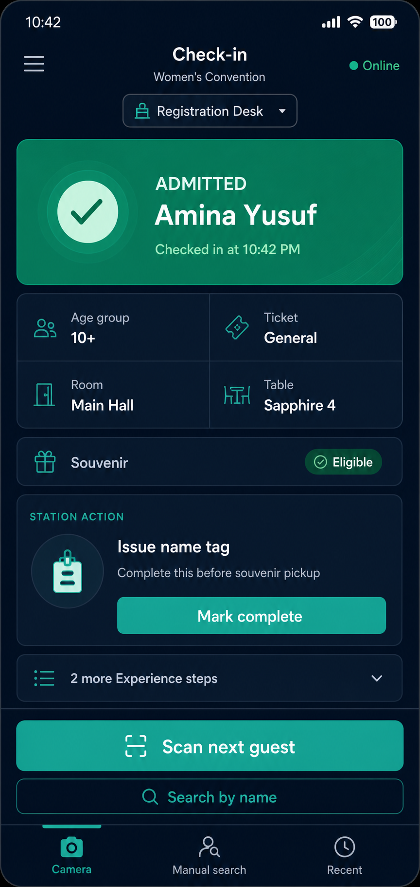
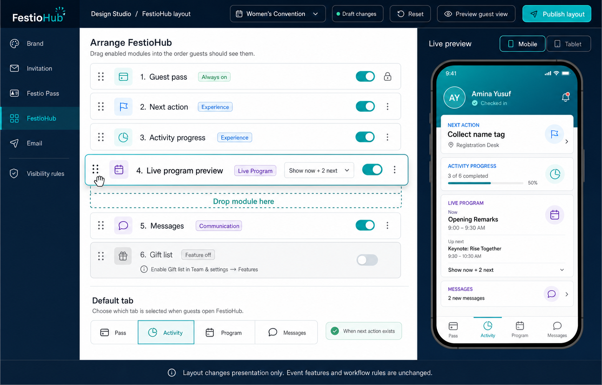

# FestioHub, Festio Pass, FestioMe, and Check-in Concepts

These concepts deliberately keep the four surfaces separate while allowing organizers to control presentation.

## 1. FestioHub — guest journey



Purpose: guest activity, current next step, compact live-program preview, assignments, and messages.

Rules:

- full agenda lives in the Program tab;
- guest actions never include staff-only controls;
- Activity becomes the default tab when an actionable step exists;
- disabled event features do not appear;
- layout order is organizer-configurable.

## 2. Festio Pass — guest ticket



Purpose: fast QR presentation and essential admission information.

Rules:

- QR remains the dominant element;
- table, seat, entry, age group, and next-action modules render only when enabled/available;
- Activity and Program remain links/tabs rather than expanding inside the ticket;
- Design Studio pass visibility settings remain authoritative.

## 3. FestioMe — event community



Purpose: guest and organizer community, announcements, groups, conversations, polls, media, and moderation.

Rules:

- FestioHub provides a capability-gated entry point and optional compact unread/announcement preview;
- full community interaction remains in the dedicated FestioMe application;
- entitlement, event enablement, administrative blocking, membership, and availability all remain authoritative;
- a FestioMe outage never prevents FestioHub, Pass, RSVP, or Check-in from working;
- no admission decision, staff eligibility control, or full event program is duplicated in FestioMe;
- guest, moderator, and organizer controls remain role-specific.

## 4. Check-in — staff operations



Purpose: rapid admission decision and station-specific work.

Rules:

- never embeds FestioHub or the full Live Program;
- shows identity, configured age group, eligibility, assignment, and one priority staff action;
- additional Experience steps are collapsed;
- **Scan next guest** remains visible;
- station configuration controls which action is shown.

## Organizer background layout editor



The organizer can arrange FestioHub from Design Studio without changing workflow logic.

Supported controls:

- drag modules into a preferred order;
- show/hide modules that are enabled for the event;
- choose compact module variants, such as “now + two next” for Live Program;
- select the default tab and conditional default rule;
- preview mobile/tablet output;
- reset to the safe default and publish changes.

Feature-aware constraints:

- Guest Pass is always available and cannot be removed when a valid guest pass exists.
- Experience modules are selectable only when Experience is enabled.
- Program modules are selectable only when Live Program is enabled.
- Messages are selectable only when guest communication is enabled.
- Gift List, Deliveries, Seating, Orders, FestioMe, and other modules remain disabled until their existing
  event feature toggle is enabled.
- Reordering changes presentation only. It never reorders Experience dependencies, changes admission rules,
  enables paid features, or changes backend data.

## Proposed persisted layout contract

Store presentation separately from event capabilities, for example:

```json
{
  "version": 1,
  "default_tab": "activity",
  "default_tab_rule": "activity_when_next_action_exists",
  "modules": [
    { "key": "guest_pass", "visible": true, "variant": "compact" },
    { "key": "next_action", "visible": true },
    { "key": "activity_progress", "visible": true },
    { "key": "live_program", "visible": true, "variant": "now_plus_two" },
    { "key": "messages", "visible": true }
  ]
}
```

The backend must validate every module against existing feature toggles before returning it. Unknown or invalid
layouts fall back to a versioned safe default. This preserves existing events and supports future event types.
